# Arrakis — Architecture

## System Overview

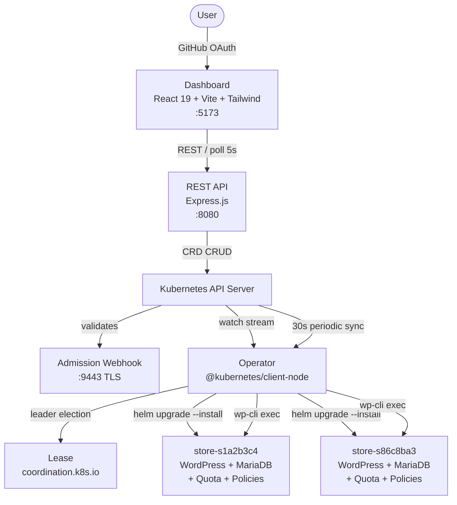

Three components. The **API** is a thin translation layer — it takes HTTP requests, writes CRDs, and returns. The **Operator** watches CRDs and reconciles desired state by provisioning namespaces, installing Helm charts, configuring WooCommerce via WP-CLI, and verifying health. The **Dashboard** polls the API and renders store status, events, and actions.

## CRD Schema

```yaml
apiVersion: arrakis.io/v1alpha1
kind: Store
metadata:
  name: s86c8ba38                    # 8-char hex ID
  finalizers: [arrakis.io/store-cleanup]
spec:
  engine: woocommerce                # woocommerce | medusajs (planned)
  storeName: "My Fashion Store"      # optional display name
  template: fashion                  # 7 templates available
  owner: "12345678"                  # GitHub user ID
  version: "1.1.0"                   # optional, triggers upgrade
  helmValues: {}                     # optional Helm --set overrides
status:
  phase: Ready                       # see state machine below
  url: http://s86c8ba38.127.0.0.1.nip.io/shop
  observedGeneration: 1              # prevents redundant reconciles
  helmRevision: 2                    # current Helm release revision
  rollbackRevision: 0                # set > 0 to trigger rollback
```

## Phase State Machine

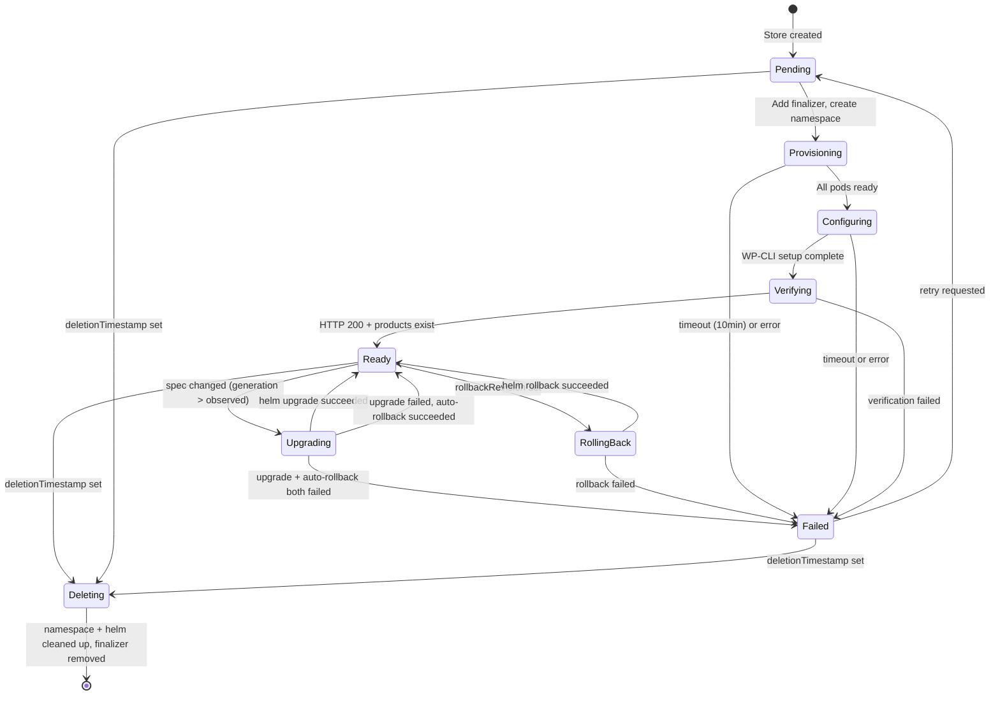

The operator tracks `status.observedGeneration` — when a Ready store's `metadata.generation` matches, the reconciler skips it entirely, avoiding redundant work.

## Reconciliation Model

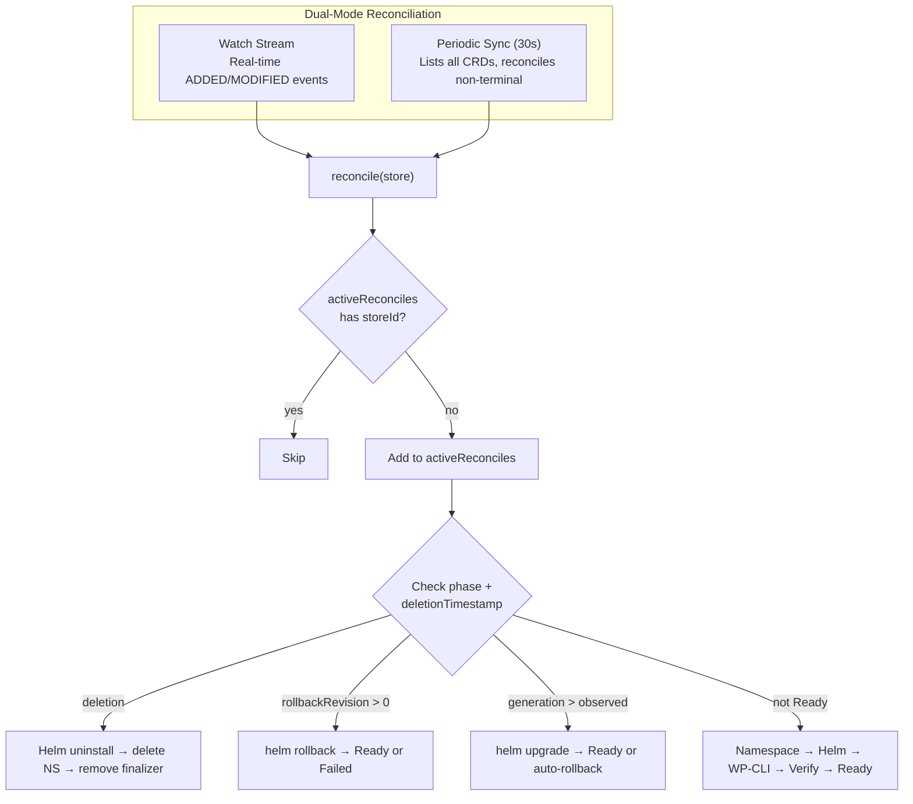

**Why dual-mode?** Watch alone is unreliable — Kubernetes watches disconnect silently. The 30s sync re-lists all CRDs and reconciles anything stuck. Same pattern as the upstream Kubernetes Deployment controller.

**Concurrency:** `activeReconciles` Set prevents duplicate reconciliation. `MAX_CONCURRENT_RECONCILES = 5` batches periodic sync to avoid overwhelming the cluster.

## 1. Production Deployment

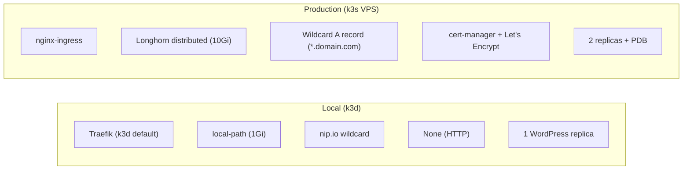

All differences are expressed through Helm values files (`values-local.yaml` vs `values-prod.yaml`) — the operator code is identical between environments. Production adds:

- **nginx-ingress** instead of Traefik for production-grade load balancing
- **cert-manager** with Let's Encrypt for automatic TLS certificate provisioning
- **Longhorn** for distributed, replicated storage (10Gi per store vs 1Gi local)
- **2 WordPress replicas** with `PodDisruptionBudget` and pod anti-affinity for node spread
- **`readOnlyRootFilesystem: true`** in container security context
- **Wildcard DNS** — `*.yourdomain.com` A record pointing to VPS IP; each store gets `{id}.yourdomain.com`

Deployed on AWS EC2 (ap-southeast-2, c7i-flex.large) running k3s, accessible at [`arrakis.ruskaruma.me`](http://arrakis.ruskaruma.me:3000).

## 2. Multi-Tenant Isolation

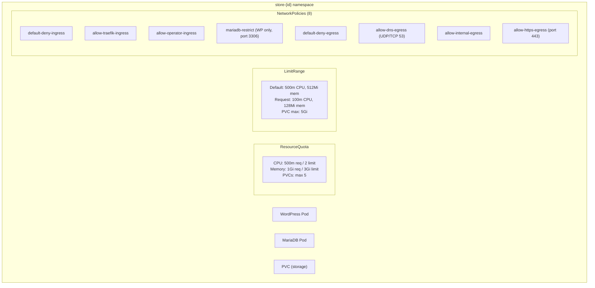

Each store gets a dedicated namespace with four layers of isolation:

- **ResourceQuota** — hard caps on CPU, memory, and PVC count per namespace
- **LimitRange** — default container limits and max PVC size, even if Helm chart doesn't specify
- **8 NetworkPolicies** — deny-by-default on both ingress and egress, with explicit allows for ingress controller, operator exec, DNS, internal pod traffic, and HTTPS outbound only
- **Namespace labels** — `arrakis.io/store-id` and `app.kubernetes.io/managed-by: arrakis` for identification

A compromised WordPress pod cannot reach other stores' databases, exfiltrate data over non-HTTPS ports, or communicate with internal services outside its namespace.

## 3. Idempotency & Recovery

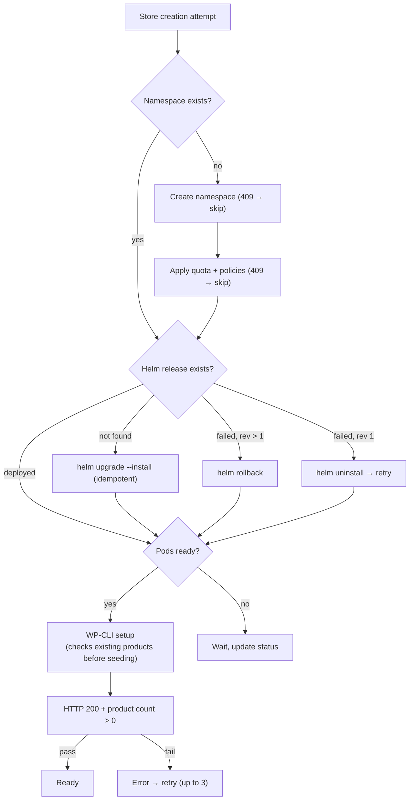

- **Namespace creation** catches HTTP 409 (already exists) and continues
- **Helm install** uses `upgrade --install` which is idempotent
- **Product seeding** checks `wp wc product list --format=count` before creating
- **All K8s resources** (quota, policies, limit range, secrets) catch 409 on create
- **Status updates** retry on 409 conflict (up to 3 attempts)
- **Operator crash recovery** — the 30s periodic sync re-lists all CRDs and reconciles anything non-terminal. No in-memory state needed; all state lives in CRD status.
- **Retry-before-fail** — errors increment `retryCount`, store resets to Pending for full re-provisioning. After 3 consecutive failures → permanent `Failed`.
- **Clean deletion** — finalizer prevents CRD garbage collection until: Helm uninstall → namespace delete → finalizer removed.

## 4. Abuse Prevention

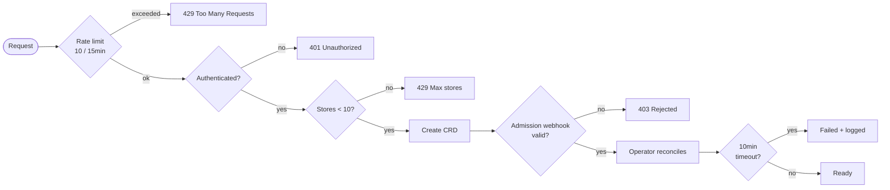

| Control | Implementation |
|---|---|
| Rate limiting | 10 store creation requests per 15 minutes (`express-rate-limit`) |
| Per-user store quota | Maximum 10 concurrent stores per authenticated user (HTTP 429) |
| Provisioning timeout | 10-minute timeout → auto-fails stores stuck in Provisioning/Configuring |
| Resource caps | ResourceQuota + LimitRange per namespace |
| 3-layer validation | CRD OpenAPI schema → admission webhook → API route handler |
| Audit trail | Structured JSON logs with IP, action, timestamp; queryable via `GET /api/audit` |

## 5. Observability

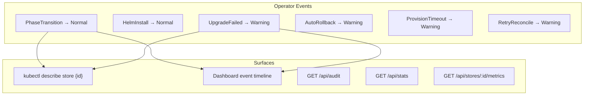

- **Kubernetes Events** — operator emits 13 event types (Normal + Warning) on every phase transition, install, upgrade, rollback, timeout, and retry. Visible via `kubectl describe store` and the dashboard.
- **Store-level event timeline** — dashboard shows events per store with timestamps, type, and message.
- **Audit log** — ring buffer of last 1000 actions (create, delete, retry, credential access) with IP and timestamp. Queryable via `GET /api/audit`.
- **Stats endpoint** — `GET /api/stats` returns store count by phase and average provisioning duration.
- **Resource metrics** — `GET /api/stores/:id/metrics` returns per-pod CPU, memory, and storage from the K8s metrics API.
- **Structured logging** — operator logs structured JSON with log code, message, and store ID context for every operation.
- **Clear failure reporting** — `status.message` contains the specific error message, retry count, and whether it was a timeout, verification failure, or Helm error.
- **Health endpoint** — operator `:9091/healthz` reports watch stream health and process uptime for liveness probes.

## 6. Security Hardening

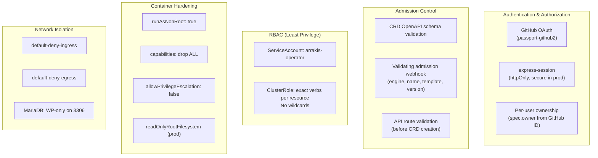

**RBAC** — operator runs under `arrakis-operator` ServiceAccount with a ClusterRole scoped to exact verbs per resource. No wildcards. No write access outside its scope.

**3-layer validation** — invalid stores are rejected at CRD schema (K8s API server), admission webhook (custom logic), and API route handler (Express validation).

**Container hardening** — all containers run as non-root, drop all capabilities, and disallow privilege escalation. Production adds read-only root filesystem.

**Network policies** — 8 policies per namespace implement deny-by-default ingress and egress. MariaDB only accepts connections from WordPress pods on port 3306.

**Secret management** — all secrets (WordPress admin password, MariaDB passwords, WC API keys) are generated at deploy time and stored as Kubernetes Secrets. No secrets in source code.

**Session security** — production requires `SESSION_SECRET` env var (exit on missing), cookies are `httpOnly` and `secure` in production.

## 7. Scaling

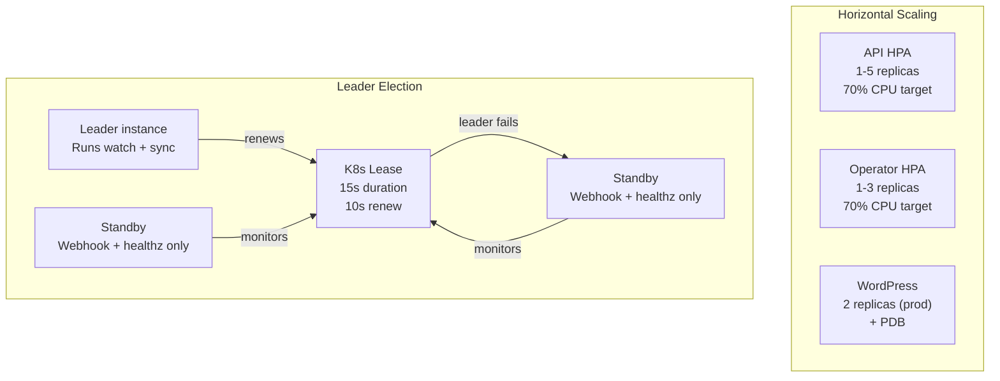

- **API** — stateless Express.js, scales horizontally via HPA (1-5 replicas on CPU).
- **Dashboard** — static React build, scales arbitrarily.
- **Operator** — Lease-based leader election (`coordination.k8s.io`). Only the leader runs watch + sync. Standby replicas serve the admission webhook and health endpoint. Failover within 15 seconds.
- **Concurrency controls** — `MAX_CONCURRENT_RECONCILES = 5` batches periodic sync with `Promise.allSettled()`. `activeReconciles` Set prevents duplicate reconciliation.
- **Per-store WordPress** — 2 replicas in production with PodDisruptionBudget and pod anti-affinity for node spread.

## 8. Upgrades & Rollback

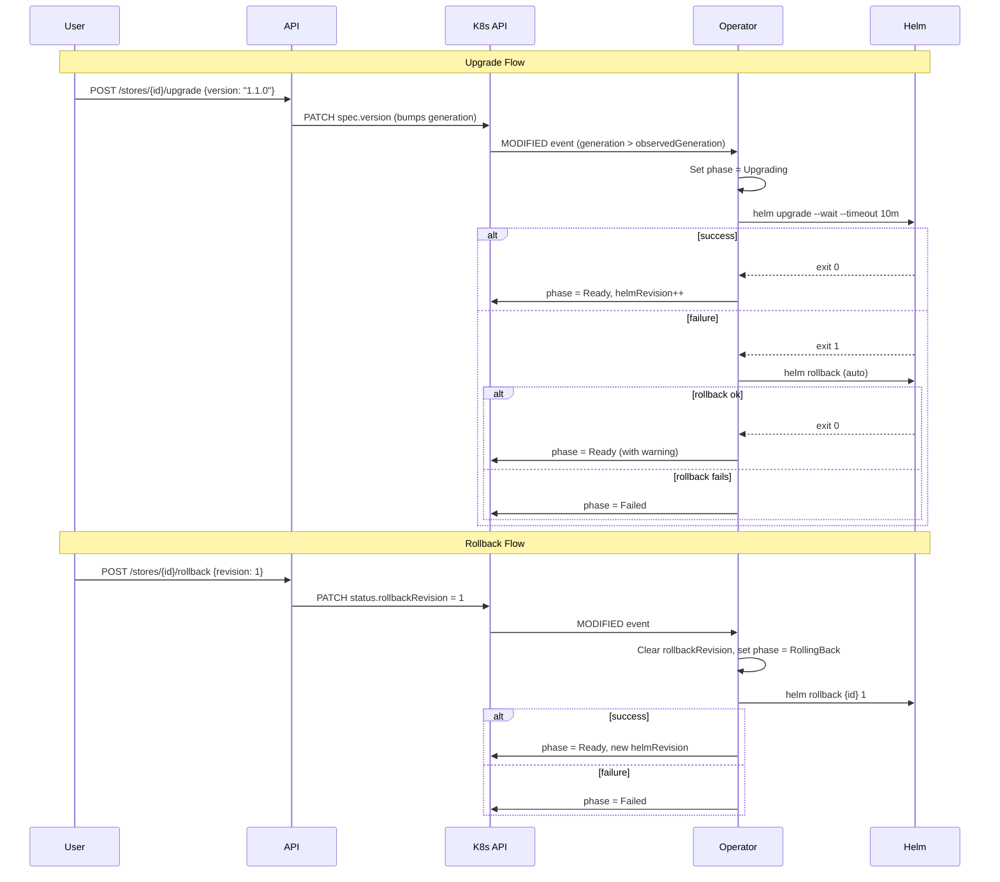

**CRD-driven upgrades** — API patches `spec.version` or `spec.helmValues`, bumping `metadata.generation`. Operator detects `generation > observedGeneration` on Ready stores, runs `helm upgrade --wait`. On failure, auto-rollbacks to the previous revision.

**Real Helm rollback** — `POST /stores/:id/rollback` sets `status.rollbackRevision` on the CRD. Operator picks it up with highest priority, clears the field to prevent re-triggering, runs `helm rollback` to the target revision.

**Revision history** — `GET /stores/:id/revisions` returns Helm release history. Dashboard shows a revision table with rollback buttons.

**Failed release recovery** — during provisioning, operator checks `helm status`. Revision > 1 with failed status → rollback. Revision 1 failed → uninstall and retry from scratch.

**Retry** — `POST /stores/:id/retry` resets to Pending with `retryCount=0` for a fresh provisioning attempt.

## Request Flow

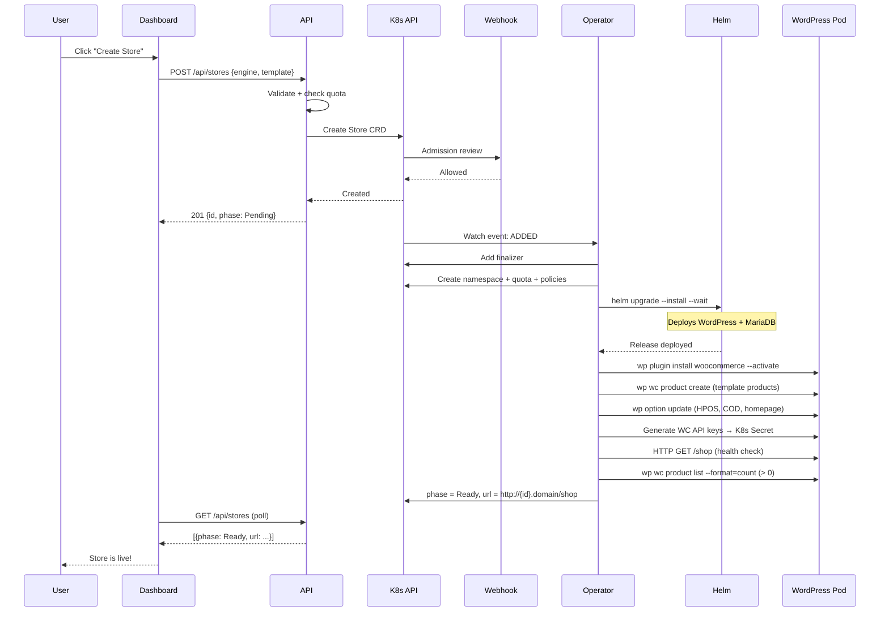

## Tradeoffs & Alternatives

| Decision | Chose | Alternative | Rationale |
|---|---|---|---|
| State management | CRD + operator reconciliation | Direct provisioning from API | Crash recovery is free, kubectl is a first-class client, upgrades are CRD patches |
| Isolation model | Namespace per store | Label-based isolation | Namespaces give real RBAC, NetworkPolicy, and ResourceQuota boundaries |
| Helm install flag | `--wait` | `--atomic` | `--atomic` deletes failed releases (and PVCs/data); `--wait` preserves them for retry |
| WP-CLI execution | `kubectl exec` into running pod | Kubernetes Jobs | Jobs consume quota, need cleanup, add latency; exec is faster and simpler |
| Watch reliability | Watch + 30s periodic sync | Watch only | Watches disconnect silently; sync is the consistency guarantee |
| Leader election | K8s Lease API | etcd lock / external coordinator | Native K8s primitive, no external dependencies, 15s failover |
| Dashboard updates | 5s polling | WebSocket / SSE | Polling is simpler, works through proxies/load balancers, acceptable latency for this use case |
