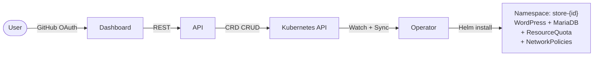
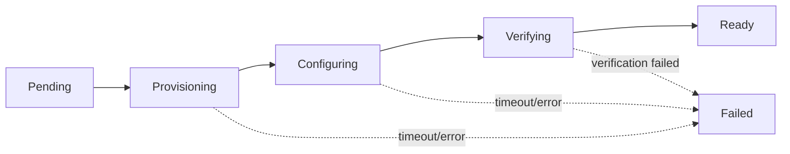
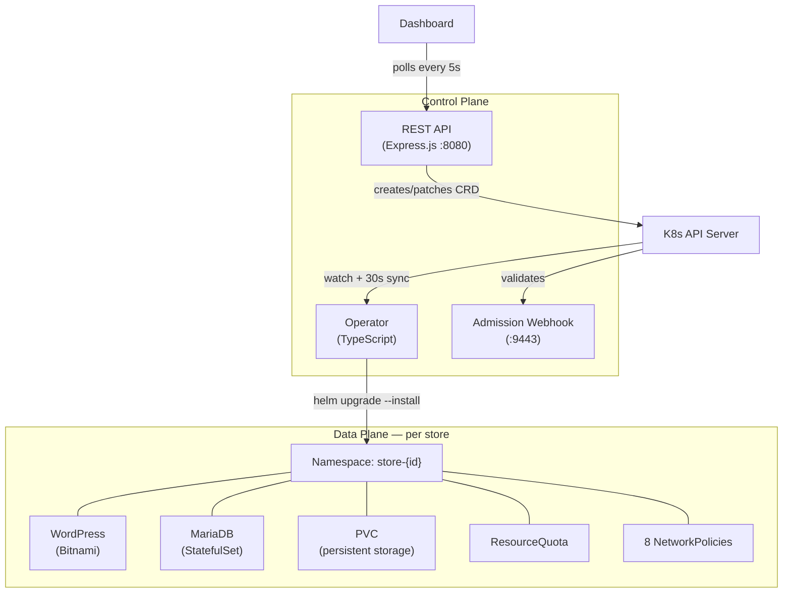

# Arrakis

Multi-tenant WooCommerce provisioning platform on Kubernetes. Spin up fully-configured, isolated e-commerce stores with a single API call. Each store gets its own namespace, resource quotas, network policies, Helm-managed lifecycle, and automated cleanup.



### Live Demo

Deployed on AWS EC2 (ap-southeast-2) with k3s, accessible at [`arrakis.ruskaruma.me`](http://arrakis.ruskaruma.me:3000).

## Features

- **One-click store creation** — pick a template, get a live WooCommerce store
- **7 themed templates** — general, fashion, food, electronics, beauty, sports, books
- **CRD-driven lifecycle** — upgrades, rollbacks, retry, deletion all through the K8s API
- **Per-tenant isolation** — dedicated namespace, ResourceQuota, LimitRange, 8 NetworkPolicies
- **Helm revision history** — view revisions, rollback to any previous version from the dashboard
- **GitHub OAuth** — per-user ownership, scoped access to your stores only
- **Validating admission webhook** — rejects invalid CRDs at the API server level
- **Leader-elected operator** — Lease-based HA with automatic failover
- **Live provisioning UI** — elapsed timer, phase steps, event timeline, resource metrics
- **Audit logging** — every action logged with timestamp, store ID, and client IP
- **Light/dark theme** — system-aware with manual toggle

## Try It

The platform is deployed live on AWS EC2 (ap-southeast-2) running k3s. Create a store and watch it provision in real time:

| Service | URL |
|---------|-----|
| Dashboard | [`arrakis.ruskaruma.me`](http://arrakis.ruskaruma.me:3000) |
| API | [`api.arrakis.ruskaruma.me`](http://api.arrakis.ruskaruma.me:8080) |

Or via curl:

```bash
# Create a store
curl -X POST http://api.arrakis.ruskaruma.me:8080/api/stores \
  -H "Content-Type: application/json" \
  -d '{"engine": "woocommerce", "storeName": "My Fashion Store", "template": "fashion"}'

# List stores
curl http://api.arrakis.ruskaruma.me:8080/api/stores
```

## Running Locally

If you'd like to run Arrakis on your own machine, here's how.

### Prerequisites

| Tool | Version | Install |
|------|---------|---------|
| Node.js | 22+ | [nodejs.org](https://nodejs.org) |
| Docker | any | [docs.docker.com](https://docs.docker.com/get-docker) |
| kubectl | any | [kubernetes.io](https://kubernetes.io/docs/tasks/tools) |
| Helm | 3.x | [helm.sh](https://helm.sh/docs/intro/install) |
| k3d | any | [k3d.io](https://k3d.io) |

### Automated Setup

```bash
git clone https://github.com/ruskaruma/arrakis.git
cd arrakis
chmod +x setup.sh
./setup.sh
```

The script creates a k3d cluster, applies CRDs, builds Helm dependencies, installs npm packages, and starts all three services. Once complete:

| Service | URL |
|---------|-----|
| Dashboard | [http://localhost:5173](http://localhost:5173) |
| API | [http://localhost:8080](http://localhost:8080) |
| Swagger Docs | [http://localhost:8080/api/docs](http://localhost:8080/api/docs) |

```bash
# Flags
./setup.sh --skip-cluster   # reuse existing k3d cluster
./setup.sh --with-auth       # enable GitHub OAuth (requires .env)
```

<details>
<summary><strong>Manual Setup (step by step)</strong></summary>

#### 1. Create cluster

```bash
k3d cluster create arrakis --port "80:80@loadbalancer"
```

#### 2. Apply CRD and RBAC

```bash
kubectl apply -f config/crd.yaml
kubectl apply -f config/rbac.yaml
```

#### 3. Build Helm dependencies

```bash
cd helm-charts/woocommerce && helm dependency build && cd ../..
```

#### 4. Start operator

```bash
cd operator && npm install
SKIP_LEADER_ELECTION=true npx ts-node src/index.ts
```

#### 5. Start API (separate terminal)

```bash
cd api && npm install
SKIP_AUTH=true npx ts-node src/server.ts
```

#### 6. Start dashboard (separate terminal)

```bash
cd dashboard && npm install && npm run dev
```

</details>

<details>
<summary><strong>GitHub OAuth Setup</strong></summary>

Create a GitHub OAuth App at [github.com/settings/developers](https://github.com/settings/developers) with callback URL `http://localhost:8080/auth/github/callback`, then create `api/.env`:

```env
GITHUB_CLIENT_ID=<your-client-id>
GITHUB_CLIENT_SECRET=<your-client-secret>
SESSION_SECRET=<random-string>
DASHBOARD_URL=http://localhost:5173
GITHUB_CALLBACK_URL=http://localhost:8080/auth/github/callback
```

Then start the API without `SKIP_AUTH`:

```bash
cd api && npx ts-node src/server.ts
```

</details>

## Usage

### Create a store

**Dashboard:** Open the dashboard ([live](http://arrakis.ruskaruma.me:3000) or [local](http://localhost:5173)), click "Create Store", pick a template, hit create.

**API:**

```bash
curl -X POST http://localhost:8080/api/stores \
  -H "Content-Type: application/json" \
  -d '{"engine": "woocommerce", "storeName": "My Fashion Store", "template": "fashion"}'
```

```json
{
  "id": "s86c8ba38",
  "engine": "woocommerce",
  "storeName": "My Fashion Store",
  "template": "fashion",
  "phase": "Pending",
  "url": null
}
```

The store progresses through the provisioning pipeline:



Once `Ready`, the store is live at the URL in the response (e.g., `http://s86c8ba38.arrakis.ruskaruma.me/shop` on production or `http://s86c8ba38.127.0.0.1.nip.io/shop` locally).

### Templates

Each template seeds different themed products:

| Template | Products |
|----------|----------|
| `general` | Arrakis Spice Blend ($42) |
| `fashion` | Desert Silk Robe ($89), Stillsuit Jacket ($149), Fremen Sandals ($59) |
| `food` | Spice Melange Tea ($24), Arrakeen Coffee Beans ($32), Sietch Bread Mix ($12) |
| `electronics` | Holtzman Shield Generator ($299), Ornithopter Navigation Module ($199), Thumper Device ($79) |
| `beauty` | Spice Essence Perfume ($68), Desert Rose Skin Oil ($45), Sietch Mineral Soap ($18) |
| `sports` | Sandworm Rider Harness ($185), Fremen Combat Training Kit ($120), Desert Running Sandals ($75) |
| `books` | The Collected Sayings of Muad'Dib ($32), Ecology of Dune ($28), The Orange Catholic Bible ($55) |

### Upgrade a store

```bash
curl -X POST http://localhost:8080/api/stores/{id}/upgrade \
  -H "Content-Type: application/json" \
  -d '{"version": "1.1.0"}'
```

The operator detects the spec change, runs `helm upgrade --wait`, and auto-rollbacks on failure.

### Rollback to a previous revision

```bash
# Rollback to a specific revision
curl -X POST http://localhost:8080/api/stores/{id}/rollback \
  -H "Content-Type: application/json" \
  -d '{"revision": 1}'

# View revision history
curl http://localhost:8080/api/stores/{id}/revisions
```

### Retry a failed store

```bash
curl -X POST http://localhost:8080/api/stores/{id}/retry
```

### Place an order

Once a store is `Ready`, go to its URL (e.g., `http://s86c8ba38.127.0.0.1.nip.io/shop`):

1. Browse the storefront — template products are already listed
2. Add a product to cart
3. Go to checkout
4. Fill in any billing details (test data is fine)
5. Select "Cash on Delivery" as payment
6. Place order

The order is stored in WooCommerce's HPOS tables (High-Performance Order Storage) for fast queries.

### Delete a store

```bash
curl -X DELETE http://localhost:8080/api/stores/{id}
```

The finalizer ensures namespace, Helm release, and all resources are cleaned up before the CRD is removed.

### Manage products

```bash
# List products
curl http://localhost:8080/api/stores/{id}/products

# Add a product
curl -X POST http://localhost:8080/api/stores/{id}/products \
  -H "Content-Type: application/json" \
  -d '{"name": "Shai-Hulud Figurine", "regular_price": "45.00"}'

# Delete a product
curl -X DELETE http://localhost:8080/api/stores/{id}/products/{productId}
```

## API Reference

All `/api/*` routes require authentication (GitHub OAuth session or `SKIP_AUTH=true`). All store-specific endpoints enforce per-user ownership.

### Authentication

| Method | Path | Description |
|--------|------|-------------|
| `GET` | `/auth/github` | Initiate GitHub OAuth flow |
| `GET` | `/auth/github/callback` | OAuth callback |
| `GET` | `/auth/me` | Get current user |
| `POST` | `/auth/logout` | Logout |

### Stores

| Method | Path | Description | Status |
|--------|------|-------------|--------|
| `POST` | `/api/stores` | Create a store | `201` |
| `GET` | `/api/stores` | List your stores | `200` |
| `GET` | `/api/stores/:id` | Get a store | `200` |
| `DELETE` | `/api/stores/:id` | Delete a store | `204` |
| `POST` | `/api/stores/:id/retry` | Retry a failed store | `202` |
| `POST` | `/api/stores/:id/upgrade` | Upgrade (version, helmValues) | `202` |
| `POST` | `/api/stores/:id/rollback` | Rollback to a Helm revision | `202` |

### Store Data

| Method | Path | Description |
|--------|------|-------------|
| `GET` | `/api/stores/:id/revisions` | Helm revision history |
| `GET` | `/api/stores/:id/credentials` | WP-Admin username/password |
| `GET` | `/api/stores/:id/metrics` | Pod CPU/memory and storage |
| `GET` | `/api/stores/:id/events` | Kubernetes events |
| `GET` | `/api/stores/:id/products` | WooCommerce products |
| `POST` | `/api/stores/:id/products` | Create a product |
| `DELETE` | `/api/stores/:id/products/:productId` | Delete a product |

### Global

| Method | Path | Description |
|--------|------|-------------|
| `GET` | `/api/stats` | Store counts by phase, avg provision time |
| `GET` | `/api/events` | Events across all your stores |
| `GET` | `/api/audit` | Audit log (last 1000 actions) |
| `GET` | `/api/docs` | OpenAPI / Swagger UI |
| `GET` | `/health` | API health check |

## Project Structure

```
arrakis/
├── operator/src/           Kubernetes operator (TypeScript)
│   ├── index.ts            Entry point — watch stream + periodic sync + leader election
│   ├── reconciler.ts       State machine — provisions, upgrades, rollbacks, deletes stores
│   ├── helm-manager.ts     Helm CLI wrapper — install, upgrade, rollback, history
│   ├── woocommerce-setup.ts  WP-CLI orchestration — plugins, products, HPOS, API keys
│   ├── store-verifier.ts   Health check — HTTP 200 + product count > 0
│   ├── webhook.ts          Validating admission webhook (TLS on :9443)
│   ├── leader-election.ts  Lease-based leader election (coordination.k8s.io)
│   ├── k8s-helpers.ts      Namespace, quota, policies, status updates, finalizers
│   ├── kubectl.ts          kubectl exec wrapper for WP-CLI
│   ├── metrics.ts          /healthz endpoint (:9091)
│   ├── types.ts            Store CRD TypeScript types
│   └── logger.ts           Structured JSON logging
│
├── api/src/                REST API (Express.js)
│   ├── server.ts           Express app — CORS, sessions, OAuth, rate limiting
│   ├── routes/stores.ts    All store endpoints — CRUD, upgrade, rollback, products
│   ├── k8s/client.ts       Kubernetes client — CRD operations, metrics, WC API proxy
│   ├── auth/github.ts      Passport GitHub OAuth strategy
│   ├── auth/middleware.ts   isAuthenticated middleware
│   └── openapi.ts          OpenAPI 3.0 spec
│
├── dashboard/src/          React dashboard (Vite + Tailwind CSS 4)
│   ├── App.tsx             Main app — routing, polling, auth state
│   ├── api.ts              API client — typed fetch wrappers
│   ├── components/
│   │   ├── StoreCard.tsx    Store card — status, actions, events, products, metrics
│   │   ├── StoreDetail.tsx  Full store view — revisions, commands, CRD info
│   │   ├── CreateStoreModal.tsx  Store creation form with template picker
│   │   ├── Header.tsx       Nav bar with theme toggle
│   │   ├── StatsBar.tsx     Phase counts and avg provision time
│   │   ├── ActivityLog.tsx  Global event timeline
│   │   ├── EmptyState.tsx   Empty state illustration
│   │   ├── LoginPage.tsx    GitHub OAuth login
│   │   └── Toast.tsx        Toast notification system
│   ├── ThemeContext.tsx     Light/dark theme provider
│   ├── utils.ts            timeAgo, formatDuration helpers
│   └── index.css           Tailwind + CSS variables
│
├── config/                 Kubernetes manifests
│   ├── crd.yaml            Store CRD (arrakis.io/v1alpha1)
│   ├── rbac.yaml           ServiceAccount + ClusterRole + Binding
│   ├── webhook.yaml        ValidatingWebhookConfiguration
│   ├── hpa-operator.yaml   HPA for operator (1-3 replicas, 70% CPU)
│   ├── hpa-api.yaml        HPA for API (1-5 replicas, 70% CPU)
│   ├── *-deployment.yaml   Deployment manifests for all components
│   └── scripts/            Cert generation for webhook TLS
│
├── helm-charts/
│   └── woocommerce/        Bitnami WordPress subchart
│       ├── Chart.yaml
│       ├── values-local.yaml   k3d / local dev values
│       └── values-prod.yaml    k3s / production values
│
├── setup.sh                Automated local setup script
└── ARCHITECTURE.md         Detailed system design document
```

## Production Deployment (k3s)

<details>
<summary><strong>Full production setup guide</strong></summary>

### 1. Install k3s

```bash
curl -sfL https://get.k3s.io | sh -
```

### 2. Install infrastructure

```bash
# Ingress controller
helm repo add ingress-nginx https://kubernetes.github.io/ingress-nginx
helm install ingress-nginx ingress-nginx/ingress-nginx -n ingress-nginx --create-namespace

# TLS via Let's Encrypt
helm repo add jetstack https://charts.jetstack.io
helm install cert-manager jetstack/cert-manager -n cert-manager --create-namespace --set crds.enabled=true

# Distributed storage
helm repo add longhorn https://charts.longhorn.io
helm install longhorn longhorn/longhorn -n longhorn-system --create-namespace
```

### 3. Apply CRD, RBAC, and set domain

```bash
kubectl apply -f config/crd.yaml
kubectl apply -f config/rbac.yaml
```

Configure a wildcard DNS record (`*.yourdomain.com`) pointing to the VPS IP.

### 4. Start with production config

```bash
cd operator && npm install
STORE_BASE_DOMAIN=yourdomain.com npx ts-node src/index.ts
```

### Local vs Production differences

| Concern | Local | Production |
|---|---|---|
| Cluster | k3d | k3s on VPS |
| Ingress | Traefik (k3d default) | nginx-ingress |
| TLS | None (HTTP) | cert-manager + Let's Encrypt |
| Storage | local-path (1Gi) | Longhorn distributed (10Gi) |
| WordPress replicas | 1 | 2 + PodDisruptionBudget |
| Container security | runAsNonRoot, drop ALL | + readOnlyRootFilesystem |
| DNS | nip.io wildcard | Real domain wildcard A record |

</details>

## Horizontal Pod Autoscaling

HPA manifests are provided for both the operator and API:

```bash
kubectl apply -f config/hpa-operator.yaml   # 1-3 replicas at 70% CPU
kubectl apply -f config/hpa-api.yaml         # 1-5 replicas at 70% CPU
```

The operator uses Lease-based leader election — only the leader reconciles. Standby replicas serve the admission webhook and health endpoint.

## Tech Stack

| Layer | Technology |
|-------|-----------|
| Operator | TypeScript, @kubernetes/client-node v1.4.0 |
| API | Express.js, passport-github2, express-session, express-rate-limit |
| Dashboard | React 19, Vite 7, Tailwind CSS 4 |
| Helm | Chart API v2, Bitnami WordPress 28.x |
| Cluster | k3d (local), k3s (production) |
| DNS | nip.io wildcard (local), real domain (production) |

## System Design & Tradeoffs



**Why CRD + operator over direct provisioning?** The API only writes CRDs — the operator reconciles desired state. This means: crash recovery is free (operator re-reads CRDs on restart), upgrades/rollbacks are just CRD patches, and `kubectl` is a first-class client alongside the dashboard.

**Why namespace-per-store over labels?** Namespaces give real security boundaries: NetworkPolicy scope, ResourceQuota enforcement, RBAC isolation, and clean teardown (`kubectl delete ns` removes everything). The overhead is negligible at expected scale (tens to hundreds of stores).

**Why `helm upgrade --install --wait` over `--atomic`?** `--atomic` auto-deletes failed releases including PVCs and data. `--wait` leaves failed releases in place for diagnosis and retry without data loss.

**Why `kubectl exec` for WP-CLI over Kubernetes Jobs?** Jobs create extra pods (consuming quota), need cleanup, and add latency. Direct exec into the running WordPress pod is faster and uses the same container that serves traffic.

## Architecture

See [ARCHITECTURE.md](./ARCHITECTURE.md) for the full system design document covering:

- Reconciler state machine and dual-mode reconciliation
- CRD schema and phase transitions
- Tenant isolation (ResourceQuota, LimitRange, NetworkPolicies)
- Leader election protocol
- Security posture (webhook, RBAC, container hardening, audit logging)
- Upgrade/rollback mechanics
- Idempotency and crash recovery
- Tradeoffs and alternatives considered

---

### A Note

This was a heavy build. I spent a lot of late nights thinking through the architecture, reading Kubernetes docs, debugging Helm charts, and figuring out how all the pieces fit together. I wrote the majority of the code myself — the operator reconciler, leader election, CRD design, webhook, WP-CLI orchestration, API routes, and the overall system design were all mine. That said, it was a big scope, and I'm one person, so I leaned on Google and Claude (free tier) to help me move faster on boilerplate, figure out K8S client-node API quirks, and debug issues. Frontend and UI aren't my strongest suit, so the dashboard leans more on AI assistance than the backend does — which is why parts of the CSS or component structure look a bit cookie-cutter. I tried to make it functional and clean regardless. Everything in the architecture doc and the design decisions behind this project are genuinely mine.

This project was made by **ruskaruma** and is owned and protected under the **MIT  License**.
